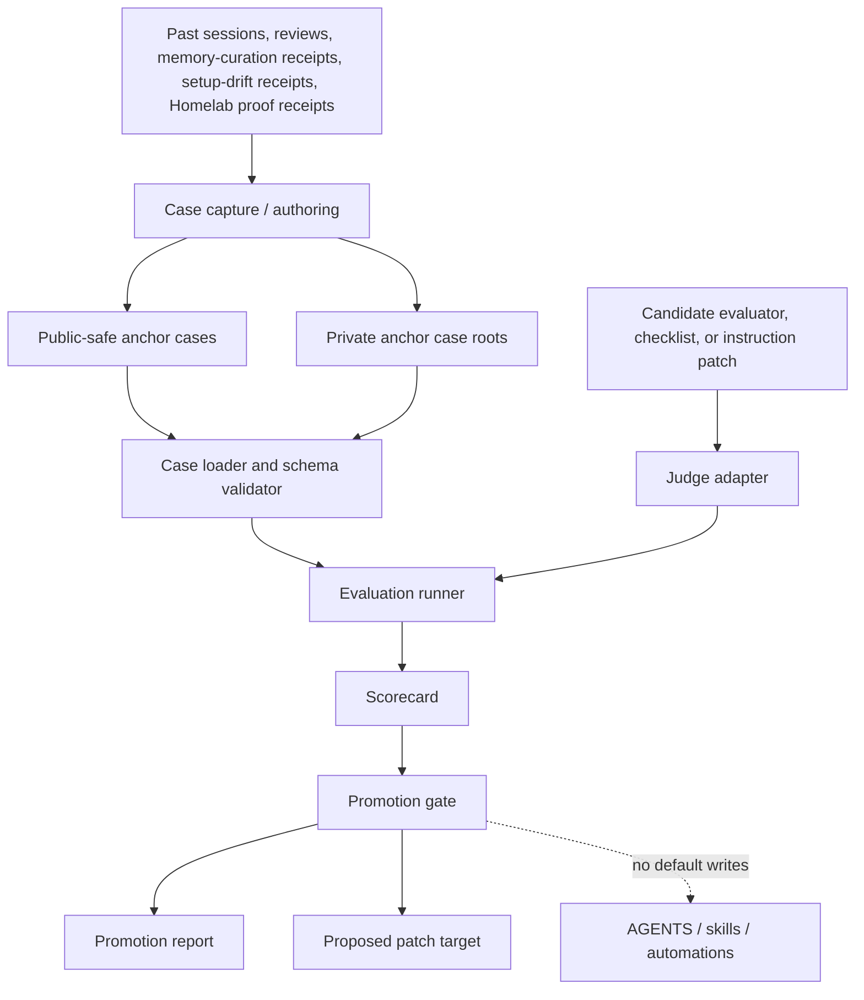
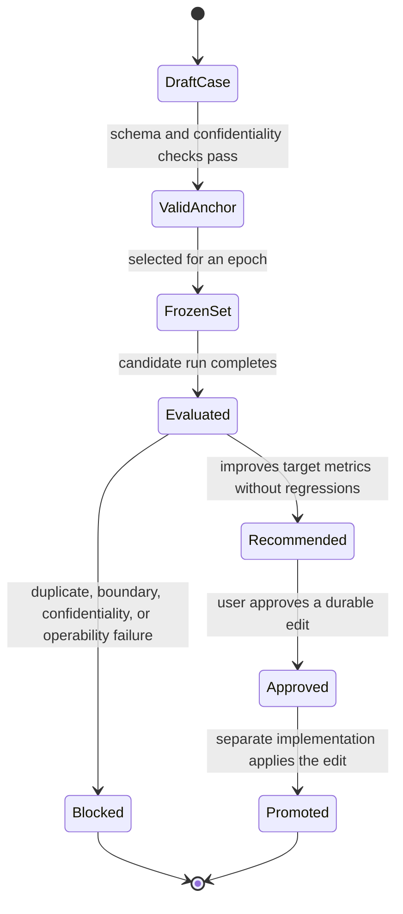

# Evaluator Promotion System - Plan

## Goal Capsule

| Field | Value |
|---|---|
| Objective | Add a local evaluator-promotion system that turns real workflow failures and accepted fixes into anchor cases, evaluates candidate reviewer/instruction changes against them, and emits promotion reports without mutating durable instructions by default. |
| Authority | Repo instructions and user-approved workflow boundaries outrank evaluator scores; evaluator reports inform promotion but never grant write authority on their own. |
| Execution profile | Code implementation in `agent-scripts`, using dependency-light Ruby/stdlib patterns and repo-local validation. |
| Stop conditions | Stop before adding model/API-key dependencies, writing private transcript content into the repo, promoting instructions without explicit approval, or treating Homelab source/workbench proof as runtime proof. |
| Tail ownership | After implementation, normal closeout uses repo validators, focused tests, and `autoreview`; any durable AGENTS, skill, or automation change remains a separate approved edit. |

---

## Product Contract

### Summary

This plan builds a guarded local evaluator lane for Paul's Codex setup: agents can propose better evaluation rules, but promotion depends on frozen anchor cases, stable scorecards, duplicate-coverage checks, and existing proof-boundary rules.
The first slice treats Homelab/OpenClaw, setup drift, self-improve, `autoreview`, and local automation workflows as first-class sources while keeping private machine truth out of public-safe fixtures.

### Problem Frame

Paul's setup already has strong pieces for self-improvement: `autoreview` for closeout checks, self-improve proposal passes, memory-curation dry-runs, setup-drift audits, and clear source/runtime boundaries for Homelab work.
The weak point is that evaluator and instruction improvements are still mostly reviewed as prose.
A durable improvement loop needs anchor cases that encode known failures and accepted fixes, then a promotion gate that can say whether a candidate evaluator or instruction patch improves the system without adding duplicate policy text or crossing an authorization boundary.

The RQGM paper motivates the broad pattern of co-evolving agents and evaluators, but this repo should implement only the local operating-system version: frozen anchors, dry-run evaluation, explicit approval gates, and small portable helpers.

### Requirements

**Anchor Cases**

- R1. The system defines a stable anchor-case format for task context, authorized boundary, expected evidence, expected action, forbidden action, and promotion criteria.
- R2. Anchor cases preserve proof-surface distinctions, including source, workbench, host/runtime, GitHub, Notion mirror, local automation, and user-reported completion.
- R3. Public-safe cases may live in this repo, while private/Homelab cases are loaded from caller-provided private case roots and never copied into public fixtures by default.
- R4. Raw transcript text is treated as untrusted input and excluded from repo fixtures, chat receipts, and promotion reports unless separately approved and redacted.

**Evaluation and Promotion**

- R5. The runner evaluates a candidate judge, instruction patch, or review checklist against a frozen case set and produces a deterministic report artifact.
- R6. Reports score catch rate, precision on accepted-good cases, boundary fit, duplicate coverage, operability on Paul's machine, and maintenance cost.
- R7. A candidate cannot be recommended when it worsens boundary fit, duplicates existing AGENTS/skill/automation coverage, or requires missing live routes, secrets, or tools.
- R8. Promotion output is advisory: the default result is a report plus a proposed patch target, not a direct edit to `AGENTS.MD`, skills, automations, or external systems.

**Workflow Fit**

- R9. The first implementation reuses existing repo validators and closeout practices rather than adding a new always-on daemon or external service.
- R10. Homelab/OpenClaw cases must keep source/workbench evidence distinct from runtime evidence and must support the documented source-workbench and runtime-probe routes as evidence sources only when the case explicitly calls for live checks.
- R11. The system provides enough CLI structure for `self-improve`, `autoreview`, setup-drift, and memory-curation lanes to add cases without each lane inventing its own schema.
- R12. CI and local tests prove schema validation, private/public case separation, judge command isolation, score aggregation, and promotion-gate decisions.

### Scope Boundaries

#### In Scope

- A repo-local evaluator-promotion CLI and library.
- Public-safe sample cases that encode workflow classes rather than private content.
- A private-case loading contract for Homelab/OpenClaw and Mac-local cases.
- Dry-run reports suitable for review before any durable instruction or automation edit.
- Documentation for case authoring, promotion interpretation, and integration with existing closeout flows.

#### Deferred to Follow-Up Work

- Direct model-provider adapters beyond a command-based judge adapter.
- Automatic patch application to global Codex instructions, repo AGENTS files, skills, or automations.
- UCL/application-writing anchors and personal knowledge-work cases.
- Notion or GitHub issue creation from promotion reports.
- Long-running scheduled evaluator monitors.

#### Outside This Product's Identity

- Training or fine-tuning models.
- Treating evaluator scores as permission to mutate live systems.
- Publishing private transcript, Homelab topology, credential, or organization-specific details.
- Replacing `autoreview`, self-improve, memory curation, or setup-drift tools; this system evaluates and promotes improvements around them.

### Acceptance Examples

- AE1. Given a candidate rule that tells agents to add another duplicate "live proof first" instruction, when the promotion runner evaluates it against existing AGENTS and skill coverage, then the report blocks recommendation as duplicate coverage.
- AE2. Given a Homelab case where source-workbench proof exists but runtime proof is missing, when a candidate evaluator accepts the task as complete, then the report marks a boundary-fit failure.
- AE3. Given a memory-curation case where a deterministic extractor returns zero candidates despite user correction requiring judgment, when a candidate evaluator treats zero candidates as automatically acceptable, then the report records a missed catch.
- AE4. Given a private case root with redacted Homelab cases and a public fixture set, when the runner produces a report, then the report includes case IDs, scores, and evidence categories but no raw private transcript excerpts.
- AE5. Given a candidate that improves catch rate but requires an unavailable model API key, when the promotion gate runs on Paul's machine, then the report records the operability failure and withholds promotion.

---

## Planning Contract

### Key Technical Decisions

- KTD1. Use a dependency-light Ruby CLI with small library modules. This follows the repo's current helper style (`scripts/audit-machine-setup`, `scripts/validate-skills`, `scripts/sync-codex-memories`) and keeps installation simple on the Mac and source workbenches.
- KTD2. Keep anchor cases as plain YAML files with a repo-documented schema rather than a database. Cases need code review, portability, and easy private/public separation more than query power.
- KTD3. Start with a command-based judge adapter. The runner invokes a caller-supplied command through argument-vector execution, passes a bounded case bundle, and expects structured scores, which avoids hard-coding model providers, secrets, shell interpolation, or Codex internals into the first slice.
- KTD4. Make promotion two-stage: evaluate first, recommend second. The scoring runner can produce detailed measurements, but the promotion gate alone decides whether the candidate is recommendable under duplicate-coverage, proof-boundary, confidentiality, and operability rules.
- KTD5. Treat private cases as external inputs, not repo artifacts. The repo owns schema, public-safe examples, tests, and tooling; private Homelab/Mac cases stay in caller-selected private roots or private forks.
- KTD6. Preserve existing workflow authorities. `autoreview` remains the closeout reviewer, self-improve remains propose-first, setup-drift remains read-only unless approved, and Homelab runtime proof remains separate from source/workbench proof.

### High-Level Technical Design

### Evaluation Dimensions

| Dimension | What It Measures | Blocks Promotion When |
|---|---|---|
| Catch rate | Known bad outcomes caught by the candidate | A must-catch anchor is missed. |
| Precision | Accepted-good cases left alone | The candidate nags or blocks valid prior behavior. |
| Boundary fit | Respect for source/runtime, read-only, draft-only, mirror, and authorization boundaries | A candidate collapses evidence surfaces or permits an unauthorized mutation. |
| Novelty | Whether the proposal adds non-duplicate coverage | Existing AGENTS, skills, or automations already cover the behavior. |
| Operability | Whether required commands, paths, and tools exist in the current workflow | The candidate depends on unavailable routes, secrets, plugins, or services. |
| Maintenance cost | Size and complexity of the durable rule or evaluator change | The proposal creates broad doctrine where a narrow case or skill fix would do. |

### Research Notes

- The repo is a compact helper-and-skill surface, not an application framework: Ruby helper scripts, TypeScript utilities, skill folders, docs, hooks, and a small GitHub Actions smoke workflow.
- Codebase graph indexing is available for this repo under `Users-paulcouach-Projects-agent-scripts`; the graph shows script and skill clusters as the real implementation seams.
- Existing validation surfaces are `scripts/validate-skills`, `scripts/audit-machine-setup`, `bun scripts/docs-list.ts`, the pre-commit hook, and the GitHub Actions smoke workflow.
- Memory evidence shows self-improve must stay propose-first with duplicate-coverage checks before promotion, and setup-drift/watch lanes must stay read-only unless a named mutation is approved.
- Homelab memory evidence says a source workbench can also be a runtime-access client, but it is not blanket runtime authority; source, workbench, and runtime proof stay separate.
- The RQGM paper is a conceptual input for frozen evaluator epochs, not an implementation dependency.

### Risks and Mitigations

| Risk | Mitigation |
|---|---|
| Private evidence leaks into public fixtures or chat receipts. | Make redaction/schema checks part of case validation; public fixtures use synthetic or paraphrased facts only. |
| The evaluator begins rubber-stamping its own proposed rules. | Freeze anchor sets per run and require duplicate, boundary, and operability gates before recommendation. |
| The first slice becomes a new orchestration daemon. | Keep the interface as an explicit CLI; scheduled monitors are deferred. |
| Homelab cases accidentally imply runtime permission. | Cases must declare evidence surface and authorized boundary; runtime proof anchors fail when source proof is substituted. |
| Model/provider churn blocks adoption. | Use command adapters and fake judges in tests; direct model adapters are follow-up work. |

---

## Implementation Units

### U1. Anchor Case Format and Public Fixtures

- **Goal:** Define the anchor-case contract and add public-safe seed cases for the workflows this plan targets.
- **Requirements:** R1, R2, R3, R4, R10, R11
- **Dependencies:** None
- **Files:** `evals/agent-promotion/README.md`, `evals/agent-promotion/case-schema.md`, `evals/agent-promotion/cases/public/self-improve-duplicate-coverage.yml`, `evals/agent-promotion/cases/public/homelab-source-vs-runtime.yml`, `evals/agent-promotion/cases/public/memory-curation-judgment.yml`, `test/evaluator_promotion/case_schema_test.rb`
- **Approach:** Model each case around the decision the evaluator should make, not around a raw transcript. Include fields for `case_id`, `lane`, `input_summary`, `authorized_boundary`, `evidence_surfaces`, `expected_findings`, `forbidden_findings`, `promotion_checks`, and `confidentiality_level`.
- **Execution note:** Start with schema tests before adding fixtures so the public examples are constrained by the intended contract.
- **Patterns to follow:** Keep docs terse like `README.md`; keep YAML parsing aligned with `scripts/validate-skills`.
- **Test scenarios:**
  - Happy path: a complete public case with source and runtime evidence categories validates successfully.
  - Edge case: a case with no `forbidden_findings` validates only when it explicitly states why no anti-action is expected.
  - Error path: a case missing `authorized_boundary` fails with the missing field named.
  - Error path: a public case marked with private transcript content fails confidentiality validation.
  - Integration: all seed fixtures under `evals/agent-promotion/cases/public` validate through the same loader used by the runner.
- **Verification:** The fixture set validates deterministically and expresses the three initial workflow classes without private details.

### U2. Evaluator Promotion CLI and Library Skeleton

- **Goal:** Add the CLI entry point and small library modules that load cases, normalize candidate inputs, and write reports.
- **Requirements:** R5, R8, R9, R11, R12
- **Dependencies:** U1
- **Files:** `scripts/evaluator-promotion`, `lib/evaluator_promotion.rb`, `lib/evaluator_promotion/case_loader.rb`, `lib/evaluator_promotion/report_writer.rb`, `test/evaluator_promotion/cli_test.rb`, `test/evaluator_promotion/case_loader_test.rb`
- **Approach:** Keep `scripts/evaluator-promotion` as a thin adapter over library modules. Support subcommands for case validation, evaluation dry-run, and report inspection. Use explicit exit codes for invalid cases, failed judge execution, failed promotion gate, and successful recommendation.
- **Patterns to follow:** Mirror the single-purpose Ruby style in `scripts/audit-machine-setup` and the null-safe validation posture from memory-curation learnings.
- **Test scenarios:**
  - Happy path: `validate` accepts the public fixture directory and prints a case count.
  - Happy path: `report` reads an existing JSON report and prints a compact summary without private case text.
  - Edge case: an empty case directory returns a clear no-cases result instead of passing silently.
  - Error path: an unreadable case file fails without attempting judge execution.
  - Integration: CLI and library loader agree on the same normalized case IDs and counts.
- **Verification:** The CLI can validate fixtures and inspect reports without network, secrets, or model access.

### U3. Private Case Roots and Capture Drafting

- **Goal:** Support private case inputs and draft generation without copying private source material into the repo.
- **Requirements:** R3, R4, R10, R11
- **Dependencies:** U1, U2
- **Files:** `lib/evaluator_promotion/private_roots.rb`, `lib/evaluator_promotion/case_draft.rb`, `test/evaluator_promotion/private_roots_test.rb`, `test/evaluator_promotion/case_draft_test.rb`, `evals/agent-promotion/README.md`
- **Approach:** Let callers pass one or more private case roots through CLI options or config. Draft generation should emit a template with paraphrased fields and TODO markers, not mined transcript text. Loader output must label cases by source root class so reports can distinguish public from private without disclosing private paths.
- **Patterns to follow:** Follow `scripts/sync-codex-memories` for dry-run/apply separation and receipt-style reporting; follow memory-curation evidence rules that treat raw transcript text as untrusted.
- **Test scenarios:**
  - Happy path: a run with one public and one private root loads both and labels the sources in aggregate counts.
  - Edge case: a private root that does not exist fails validation before any report is written.
  - Error path: a draft containing a transcript-excerpt marker is rejected by confidentiality checks.
  - Integration: report summaries include private case counts but not private root names or raw text.
- **Verification:** Private inputs are opt-in, dry-run visible, and never copied into public fixtures or reports by default.

### U4. Command Judge Adapter and Scoring Runner

- **Goal:** Evaluate candidates through a command adapter and aggregate per-case scores into the promotion dimensions.
- **Requirements:** R5, R6, R8, R12
- **Dependencies:** U1, U2
- **Files:** `lib/evaluator_promotion/judge_command.rb`, `lib/evaluator_promotion/scoring.rb`, `lib/evaluator_promotion/runner.rb`, `test/evaluator_promotion/judge_command_test.rb`, `test/evaluator_promotion/scoring_test.rb`, `test/fixtures/evaluator_promotion/fake_judge.rb`
- **Approach:** The runner writes a bounded case bundle to a temporary location, invokes the configured judge command without shell interpolation, parses structured JSON, and maps results to evaluation dimensions. Tests use fake judges for pass, fail, malformed output, timeout, and partial scoring cases.
- **Patterns to follow:** Keep subprocess handling explicit like `scripts/sync-codex-memories`; avoid broad environment inspection and never print secret-bearing environment values.
- **Test scenarios:**
  - Happy path: a fake judge catches all must-catch cases and the runner emits dimension scores.
  - Edge case: a judge omits optional rationale while supplying required score fields and the runner accepts it.
  - Error path: malformed judge JSON fails with the case bundle removed from temporary storage.
  - Error path: a timed-out judge marks the run inoperable rather than producing a partial recommendation.
  - Error path: a judge command containing shell metacharacters is treated as argv data or rejected, not interpolated by a shell.
  - Integration: score aggregation treats one must-catch boundary failure as promotion-blocking even when aggregate catch rate is high.
- **Verification:** Candidate evaluation works through a hermetic fake judge and never requires real model credentials.

### U5. Promotion Gate and Duplicate-Coverage Checks

- **Goal:** Decide whether a candidate can be recommended and explain blocked recommendations in the report.
- **Requirements:** R6, R7, R8, R9
- **Dependencies:** U2, U4
- **Files:** `lib/evaluator_promotion/promotion_gate.rb`, `lib/evaluator_promotion/coverage_scan.rb`, `test/evaluator_promotion/promotion_gate_test.rb`, `test/evaluator_promotion/coverage_scan_test.rb`
- **Approach:** Scan configured instruction surfaces for equivalent coverage before recommendation. The first implementation should check `AGENTS.MD`, repo skills, and caller-supplied extra surfaces, with global/private surfaces passed explicitly instead of discovered by broad home scans.
- **Patterns to follow:** Follow self-improve's propose-first and duplicate-coverage rules; follow repo confidentiality rules for public reports.
- **Test scenarios:**
  - Happy path: a candidate that improves all required dimensions and has no duplicate coverage is recommended.
  - Edge case: a candidate with a minor maintenance-cost concern is recommended only when no blocking dimensions fail.
  - Error path: a duplicate rule already present in `AGENTS.MD` blocks recommendation and names the matched surface.
  - Error path: a boundary-fit failure blocks recommendation regardless of catch-rate improvement.
  - Integration: coverage scanning can include a temporary skill fixture without reading unrelated home directories.
- **Verification:** Gate decisions are deterministic, explainable, and conservative on duplicate and boundary failures.

### U6. Workflow Integration and Validation Gates

- **Goal:** Wire the evaluator lane into existing local and CI validation without making it a mandatory always-on policy gate.
- **Requirements:** R9, R11, R12
- **Dependencies:** U1, U2, U4, U5
- **Files:** `.github/workflows/ci.yml`, `scripts/test-evaluator-promotion`, `README.md`, `test/evaluator_promotion/integration_test.rb`
- **Approach:** Add focused test execution for evaluator-promotion library code and fixture validation. Keep commit hooks unchanged in the first slice; CI and explicit local commands should validate schema and public fixtures without running model or command-judge evaluations.
- **Patterns to follow:** Preserve existing `scripts/validate-skills` as the skill gate; use `autoreview` as closeout review rather than embedding reviewer panels into this CLI.
- **Test scenarios:**
  - Happy path: the repo's evaluator tests run locally without optional private roots.
  - Edge case: CI skips private-root evaluation while still validating public fixtures.
  - Error path: a broken public fixture fails CI with the case ID surfaced.
  - Integration: `scripts/test-evaluator-promotion` succeeds without private case material.
- **Verification:** CI and local closeout prove the evaluator tooling itself without changing release, push, or merge permissions.

### U7. Documentation, Changelog, and Pilot Operating Guide

- **Goal:** Document how to author cases, run evaluations, read promotion reports, and decide whether a candidate should become a durable rule.
- **Requirements:** R1, R3, R4, R8, R10, R11
- **Dependencies:** U1, U2, U5, U6
- **Files:** `docs/evaluator-promotion.md`, `README.md`, `CHANGELOG.md`, `evals/agent-promotion/README.md`
- **Approach:** Add a concise guide that maps the evaluator system to Paul's actual lanes: self-improve, `autoreview`, setup drift, memory curation, local automation health, and Homelab/OpenClaw proof. Keep private-case examples structural rather than content-bearing.
- **Patterns to follow:** Changelog bullets should match existing style and stay one line per entry. Documentation should preserve repo-relative paths and avoid machine-private topology beyond generic source/runtime category names.
- **Test scenarios:** Test expectation: none -- this unit is documentation-only, with validation covered by `bun scripts/docs-list.ts` and markdown review.
- **Verification:** A future implementer can add one public-safe case and run one dry-run evaluation from the docs without learning hidden local conventions.

---

## Verification Contract

| Gate | Applies To | Done Signal |
|---|---|---|
| Skill validation | Any implementation touching `skills/` or shared instructions | `scripts/validate-skills` succeeds. |
| Evaluator unit tests | U1-U6 | `scripts/test-evaluator-promotion` passes, including fake-judge and promotion-gate cases. |
| Public fixture validation | U1, U2, U6 | `scripts/evaluator-promotion validate evals/agent-promotion/cases/public` succeeds and reports the expected case count. |
| Docs index | U7 and this plan's doc additions | `bun scripts/docs-list.ts` lists the new docs with summaries and read hints. |
| Machine setup awareness | Workflow integration | `scripts/audit-machine-setup` still completes and does not require private evaluator inputs. |
| Closeout review | Whole plan | `autoreview` reports no accepted/actionable findings, or every accepted finding is fixed or explicitly deferred within scope. |

---

## Definition of Done

- Public-safe anchor cases validate and cover duplicate self-improve, Homelab source-vs-runtime, and memory-curation judgment failures.
- Private case loading is opt-in and report output never prints private root paths, raw transcript text, credentials, or private topology details.
- The runner can evaluate candidates through a command adapter and produce a scorecard with catch rate, precision, boundary fit, novelty, operability, and maintenance cost.
- Promotion recommendations are blocked by duplicate coverage, boundary failures, confidentiality failures, missing operability, or unavailable required tools.
- CI/local validation proves schema, runner, fake judge, coverage scan, and promotion-gate behavior without real model credentials.
- Documentation explains how this complements `autoreview`, self-improve, setup-drift, memory curation, and Homelab proof workflows.
- Any abandoned experimental code from implementation is removed before closeout.

---

## Appendix

### Source Notes

- `README.md` identifies this repo as Paul's canonical Codex setup with skills, scripts, hooks, and Codex global symlinks.
- `AGENTS.MD` defines the source/runtime proof boundaries, Codex-only setup rules, public GitHub body safety rules, and push/merge/release authorization boundaries.
- `skills/autoreview/SKILL.md` defines structured review as advisory, scoped, and closeout-oriented.
- `skills/maintainer-orchestrator/SKILL.md` defines control-plane ownership, worker boundaries, live-proof gates, and decision-ready owner briefs.
- `skills/mac-maintenance/SKILL.md` defines read-only-by-default machine maintenance.
- The installed `self-improve` skill defines propose-first session mining and duplicate-coverage checks before AGENTS or skill promotion.
- Memory entries for memory curation, self-improve, setup drift, and Homelab runtime-access boundaries shaped the private/public split and proof-boundary requirements.
- The RQGM paper shaped the frozen-anchor/evaluator-promotion framing; this plan intentionally keeps the implementation local, dry-run, and approval-gated.
